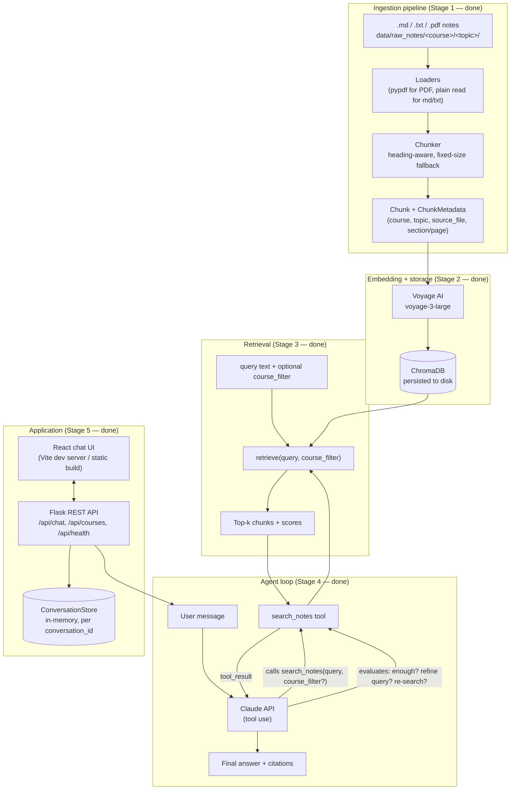

# Architecture

This document tracks the system design and the reasoning behind it. It's
written to be read once and used to defend design choices in a technical
interview — every non-obvious decision below states *why*, not just *what*.
It grows alongside the build; sections marked **(planned)** describe the
target architecture for stages not yet implemented.

## System overview (target)



## Design decisions

### Chunking strategy (Stage 1)

**Heading-aware first, fixed-size as a fallback — not the other way around.**
Course notes are usually already organized by the author into a heading
hierarchy (`# Topic` / `## Subtopic` / `### Detail`). That structure is a free,
high-quality chunk boundary: a heading section is (almost always) one
coherent concept, which is exactly what a retrieval chunk should be. Splitting
purely by fixed size instead would ignore that signal and could cut a
definition in half for no reason. So the chunker tries heading boundaries
first, and only falls back to a fixed-size sliding window when there's no
heading structure to use (plain `.txt`, or a heading section that's too big
to be one chunk on its own).

**Fixed-size chunks use word count, not token count.** A fixed-size chunk
still needs *some* size unit. The options were: LLM token count (via the
Claude API's `count_tokens` endpoint, or a local tokenizer approximation),
or a simple word count. I chose word count because:
- It's free and deterministic — no network call, no dependency on a
  tokenizer library that may or may not match Claude's actual tokenizer
  (approximating Claude's tokenizer with something like `tiktoken`, which is
  OpenAI's tokenizer, would be actively misleading).
- Chunk size doesn't need to be *exact* — it needs to be "roughly one
  concept, roughly consistent size for embedding," and word count is a fine
  proxy for that. ~300 words is roughly 400-450 tokens of English prose,
  which fits comfortably inside Voyage's embedding context with room to
  spare.
- It keeps the chunker pure-stdlib and trivially unit-testable (see
  `tests/test_chunking.py`) without mocking a tokenizer or an API.

**Overlap on the fixed-size fallback, not on heading-based chunks.**
Fixed-size chunking is the case where a boundary is genuinely arbitrary — the
sliding window can cut a sentence or a fact in half. A 50-word overlap
(against a 300-word window) means that content is very likely to appear whole
in at least one of the two adjacent chunks. Heading-based chunks don't get
overlap: their boundary is already semantically meaningful (a new heading
*is* a new topic), so padding across it would just dilute the embedding of
each chunk with unrelated neighboring content.

**A heading section that's too large still gets sub-chunked, but keeps its
section label.** If a `##` section under "Binary Search Trees" runs to 1200
words, it's still chunked with the fixed-size splitter — but every resulting
sub-chunk keeps `section = "Binary Search Trees"` in its metadata (tagged
with `chunking_method = "heading+fixed_size"` to make the hybrid explicit).
The alternative — dropping the section label once a chunk no longer maps
1:1 to a whole section — would make citations less precise for exactly the
sections most likely to matter (the longest, most detailed ones).

**PDFs are chunked per page, attempting heading detection on each page's
extracted text before falling back.** Two reasons to chunk per-page rather
than concatenating the whole PDF into one text blob first: (1) the
non-functional requirement is to cite "source filename and section/page" —
per-page chunking makes the page number free to attach, whereas
concatenating first would require separately tracking page boundaries
through the chunker; (2) `pypdf`'s `extract_text()` on a text-heavy page
already returns something reasonably close to plain text, so running the
same heading-aware chunker over each page's text is a way to opportunistically
recover real structure if the PDF happens to be an export of already-
structured notes (e.g. Markdown or slides with real heading text), while
falling back to fixed-size for image-of-text-style PDFs or ones without
markdown-style headings. This means the chunker is genuinely shared code
between text/markdown and PDF, not two parallel implementations.

**Heading detection uses a simple stack, not a full parse tree.**
`split_markdown_into_sections` tracks a stack of currently-open heading
titles by level, rather than building a nested tree of section objects with
children. Course notes almost never skip heading levels in a way that would
make a stack ambiguous (`h1` → `h3` with no `h2` in between is rare and, if
it happens, the stack just produces a shorter path — it doesn't error or
mis-attribute content). A stack is simpler to implement, reason about, and
test than a tree, for a document domain that doesn't need the tree's extra
generality.

**Fenced code blocks are heading-blind.** A `#` inside a ` ```python ` block
(a Python comment) is not treated as a Markdown heading — the chunker tracks
fence state (` ``` ` / `~~~`) and suppresses heading detection while inside
one. Without this, a code comment in a DSA note would silently fragment the
section it belongs to.

**Course/topic come from the directory structure, not front-matter or a
separate config file.** `data/raw_notes/<course>/<topic>/<file>` is the only
source of truth for those two metadata fields. This means there's nothing to
keep in sync — moving a file to a different topic folder *is* re-tagging it.
The trade-off is that a file can't easily belong to two topics at once, which
is an acceptable constraint for course notes (they're already organized this
way in practice).

### What's deliberately *not* done in Stage 1

- No embedding, no vector storage, no retrieval — those are Stage 2 and 3.
  Stage 1's job is only "raw files in, well-chunked-and-tagged `Chunk`
  objects out," verified independently via `chunks.jsonl` and the test
  suite, before any embedding cost or vector-DB complexity enters the
  picture.
- No deduplication or cross-file linking. Each file is chunked independently;
  if the same concept appears in two files, it produces separate chunks in
  separate files. This is intentional — the citation for each chunk should
  point at exactly the file the student wrote it in.

### Embedding + storage (Stage 2)

**`input_type="document"` at storage time, `input_type="query"` at search
time — this is not optional.** Voyage's embedding models accept an
`input_type` hint that changes how the model treats the text — a
document being indexed vs. a query searching for one — which meaningfully
improves retrieval quality over embedding both the same way (an asymmetric
embedding technique). Every chunk is embedded with `input_type="document"`
in `VoyageEmbedder.embed_documents`; Stage 3's retrieval function must call
`embed_query`, never `embed_documents`, for the user's search text. Getting
this backwards wouldn't error — it would just silently produce worse
retrieval, which is the kind of bug that's easy to miss without knowing to
look for it.

**One ChromaDB collection with `course`/`topic` as metadata, not one
collection per course.** A collection per course was the obvious
alternative, but it would mean the agent's `search_notes(query,
course_filter?)` tool (Stage 4) either has to pick a collection up front or
fan out across all of them for an unfiltered, cross-course search — and
"unfiltered" is the *common* case, since multi-hop questions in the spec
("compare X from the DSA notes with Y from the OS notes") need to search
across courses in one call. A single collection with `course` as a
metadata field makes an optional filter genuinely optional: no filter
searches everything, `where={"course": "dsa"}` scopes it, and both are the
same code path.

**Metadata values that are `None` are stripped before storage, not passed
through.** I discovered empirically that ChromaDB (1.5.9) doesn't error on
a `None` metadata value — it silently drops that key from the stored
record. Relying on that undocumented behavior would mean the actual stored
schema is whatever Chroma's internals decide, invisibly, and could change
between versions. `ChunkMetadata.to_chroma_metadata()` strips `None`
values explicitly, so a `.txt` chunk's absent `section`/`page` keys are a
documented, tested decision instead of a side effect discovered by reading
Chroma's source.

**Every re-embed of a file deletes that file's existing chunks before
inserting the fresh set — chunk IDs are deterministic
(`<course>/<topic>/<source_file>#<chunk_index>`) but upsert-by-ID alone
isn't enough.** If a file is edited such that it now produces fewer chunks
than before (7 → 5, say), a plain upsert correctly overwrites indices 0–4
but leaves indices 5 and 6 behind — nothing ever removes them, since
nothing new is being written to those IDs. Deleting every chunk belonging
to that file before inserting its current chunk set sidesteps the problem
entirely: the store always reflects exactly the current chunking, with no
diffing logic required. This is a local, no-network ChromaDB operation, so
it's cheap to do unconditionally on every run rather than trying to detect
whether it's actually needed.

**Voyage API calls are batched across the whole set of chunks being
embedded, not once per source file.** The first version of this pipeline
grouped chunks by source file for both the delete-stale-chunks step *and*
the embedding call, on the theory that "process one file at a time" is a
natural unit of work. In practice this was a real bug, not just a
theoretical inefficiency: running it against a freshly created Voyage
account (no payment method added yet, so subject to Voyage's reduced rate
limit of 3 requests/minute) immediately hit `RateLimitError`, because 6
sample files meant 6 back-to-back API calls in the same run. The fix was to
recognize that "which local rows are stale" and "how API calls should be
batched" are unrelated concerns — deletion stays scoped per file (a cheap,
local operation), but the embedding call batches across *all* pending
chunks up to `VOYAGE_EMBED_BATCH_SIZE`, regardless of which file they came
from. That turned our 6-file sample set from 6 API calls into 1.

**Retry with exponential backoff around each Voyage API call**, since a
third-party network call is a real, common failure mode (rate limits,
transient 5xxs) worth handling explicitly rather than letting the whole
ingestion run die on the first blip. `VoyageEmbedder` takes an injectable
`sleep_fn` specifically so this is unit-testable without actually sleeping
in the test suite (see `tests/test_voyage_client.py`). Note this is a
*retry* budget (a few seconds), not a rate-limit-window budget (up to a
minute) — see the Stage 3 note below on a real rate-limit encounter during
manual testing, which this retry logic is not intended to paper over.

### Retrieval (Stage 3)

**ChromaDB's collection distance space is set explicitly to cosine, not
left at the default.** I checked empirically rather than assumed: with no
`hnsw:space` specified, Chroma's default is squared L2, confirmed by
querying hand-constructed vectors and inspecting the returned distances.
Cosine similarity is the more standard, more interpretable choice for
embedding search — it measures direction rather than magnitude, and it
converts into a relevance score with a clean, exact formula:
`cosine_distance = 1 - cosine_similarity`, also verified empirically
against hand-computed vectors before relying on it in
`_parse_chroma_result`. The space is fixed at collection-creation time,
which is why `NotesStore` sets it explicitly rather than leaving it
implicit — an implicit default that happened to be "wrong" (squared L2,
not cosine) would have been a silent, hard-to-notice quality bug.

**`retrieve()` takes an injected `VoyageEmbedder` and `NotesStore`, mirroring
the Stage 2 dependency-injection pattern**, specifically so retrieval
*ranking* — not just retrieval *plumbing* — can be unit-tested without a
network call. `tests/fakes.py` has two fake Voyage clients for two
different testing needs: `FakeVoyageClient` (automatic length-based
embeddings) is fine for testing batching/retry mechanics, but it produces
1-D embeddings where cosine similarity between any two same-sign vectors
is trivially 1.0 — useless for testing whether ranking is actually
correct. `ScriptedVoyageClient` lets a test specify an exact embedding per
text, so `test_retriever.py` can construct chunks with deliberate,
hand-computed angular relationships to a query vector and assert the
resulting ranking and scores match real cosine-similarity math — a
genuine correctness test, not a "did it run" smoke test.

**A hard rate-limit lesson surfaced again during manual verification, and
it's worth recording rather than glossing over:** running three real
retrieval queries back-to-back against the same (payment-method-free)
Voyage account hit the same 3-requests/minute limit that Stage 2 hit
during ingestion. This is not a bug in `retrieve()` — each query
legitimately needs exactly one embedding call — it's a reminder that this
project's actual constraint at this account tier is *requests per minute
across the whole system*, not per-endpoint. It's why Stage 4's agent loop
(which can issue multiple `search_notes` calls per turn for multi-hop
questions) will need to be mindful of the same limit, and why a
production deployment on a paid tier removes this constraint rather than
needing a code change.

**`RetrievedChunk.citation()` formats `section` and `page` conditionally**
(both, either, or neither may be present, depending on chunking_method and
source format) rather than assuming a fixed template — a `.txt` chunk has
neither, a Markdown chunk typically has a section and no page, a PDF
chunk may have both. Keeping `section`/`page` as separate optional fields
on the dataclass (matching `ChunkMetadata`) rather than pre-formatting a
single citation string at retrieval time means a future caller (the API
response shape in Stage 5, say) can render them differently without
re-parsing anything.

### Agent loop (Stage 4)

**Hand-written loop, not the SDK's beta Tool Runner.** The Anthropic SDK
ships `client.beta.messages.tool_runner()`, which hides the entire
call → execute-tools → feed-results-back → repeat cycle. Using it would
mean less code, but this project's whole premise is being able to defend
*how the agent works*, not just that it works — and the loop is short and
simple enough (one tool, a `while`-shaped `for` loop, a stop-reason check)
that hand-writing it costs little and keeps every mechanic — what a tool
call looks like, how results feed back, what counts as "the model is
done" — visible and testable rather than living inside a beta helper. It
also means zero beta-API surface area: the loop runs entirely on the
stable `client.messages.create`.

**The loop does not decide *when* to re-query — the system prompt does,
and the model's own judgment executes it.** This is the actual
distinction between "an agent with a retrieval tool" and "a fixed
retrieve-then-generate pipeline," and it's worth being precise about where
that behavior actually lives: `run_agent_turn` has no code that inspects
a result set's relevance scores and decides "this is too weak, force
another search." It just runs whatever tool calls Claude asks for, in a
loop, until Claude stops asking. The instruction to evaluate whether
results are good enough, and to search again with refined terms if not,
or to search once per course for a multi-course question, lives entirely
in `prompts.py`'s system prompt. Keeping the harness this "dumb" is
deliberate — the interesting decision-making is the model's, and a harness
that tried to second-guess "was that a good enough result?" itself would
be re-implementing judgment the model is already better positioned to make.

**The `course_filter` tool parameter's `enum` is derived from
`store.distinct_courses()` at tool-build time, not hardcoded.** The four
course names already exist as ground truth in `data/raw_notes/`'s
directory structure; writing them a second time into the tool schema
would be a second place to keep in sync, and letting them drift (add a
fifth course, forget the tool schema) would either make the agent reject
a valid filter or silently accept one matching nothing.

**A hard cap (`MAX_TOOL_ITERATIONS`) forces a final tools-free call rather
than the turn ever silently returning empty.** If the model is still
asking to search after the cap, the loop makes one more call with `tools`
omitted entirely, so Claude is forced to synthesize an answer from
whatever's already been gathered rather than the conversation just
stalling. This is a defensive measure for a failure mode that shouldn't
happen often in practice (most questions resolve in 1-3 searches) but is
cheap to guard against.

**Source deduplication keeps the highest-scoring instance of each
chunk.** A refined re-query often re-surfaces some of the same chunks the
first search found (different query wording, overlapping relevant
content) — `_dedupe_sources` collapses these by
`(course, topic, source_file, chunk_index)` before the caller sees them,
so the UI doesn't show the same citation twice with two different scores.

**Testing the loop without a network call required a second fake — one
for the Claude API this time, not just Voyage.** `FakeAnthropicClient` in
`tests/fake_anthropic.py` takes a scripted list of responses and returns
them in sequence, which is what makes it possible to unit-test genuinely
agentic scenarios deterministically: a weak first search followed by a
refined re-query, parallel tool calls in one response (both must land in
a single `tool_result` user message, not two — the API requires this),
the iteration cap forcing a tools-free final call, and a `refusal`
stop_reason being handled instead of crashing. Writing this fake surfaced
a real bug in the fake itself, not the production code: the first version
stored a reference to the same mutable `messages` list on every call, so
every recorded call retroactively showed the *final* conversation state
instead of what was actually sent at that point in time — fixed by
snapshotting (`list(messages)`) at call time. Worth remembering when
building any test double around a loop that mutates a shared list across
iterations.

### Flask API + React frontend (Stage 5)

**Every Flask component takes its dependencies as constructor arguments,
same as every layer before it.** `create_app(client, embedder, store)`
takes the same three objects `Conversation` and `run_agent_turn` already
take. This isn't just stylistic consistency — it's what made it possible
to build and manually verify the *entire* stack (routes, session
handling, and the real React UI in a real browser) before the Anthropic
key existed at all: tests inject `FakeAnthropicClient`, and a small dev
script (`scripts/run_api.py`) injects a minimal canned-response stand-in
when `ANTHROPIC_API_KEY` isn't set, loudly logging that it's doing so.
Neither path required touching application code to swap in.

**Session state is a plain in-process dict, not Redis.** `ConversationStore`
maps a server-issued `conversation_id` to a `Conversation` object,
in-memory. This is a deliberate scope boundary, not an oversight: it's
adequate for a single-instance free-tier deployment (this project's actual
target), but it means state is lost on restart and can't be shared across
multiple worker processes. A production system serving real concurrent
traffic would move this to Redis, or shift to a stateless design where the
client resends full history each request (closer to how the Claude API
itself works) — both reasonable next steps, deliberately out of scope here.

**An unknown `conversation_id` silently starts a fresh conversation under
that same id, rather than returning a 404.** If the server restarted and
lost its in-memory state, or a client sends a stale id, failing the
request outright would strand the user mid-conversation with no way to
recover except starting over anyway. Starting fresh silently produces the
same practical outcome (lost context) with a better failure mode (the chat
keeps working) — a deliberate leniency trade-off, not a missed edge case.

**Errors from the agent loop are caught at the route boundary and turned
into a generic 502 with a clean JSON body — never a raw stack trace.**
`route.py`'s `/chat` handler wraps `conversation.send()` in a broad
`except Exception`, logs the real exception server-side via
`current_app.logger.exception`, and returns a message with no internal
detail leaked to the client. This matters more than it might for a typical
CRUD endpoint because the thing being called (the Claude API, the Voyage
API, ChromaDB) is three network dependencies deep — plenty of ways for a
transient failure to surface, and none of them are things a chat user
should see a Python traceback about.

**No manual course-filter control in the UI.** The `search_notes` tool
already accepts an optional `course_filter`, and the whole point of this
project is that *the agent* decides when and how to use it — adding a
dropdown that lets the user override that decision would undercut the
"agentic, not a fixed pipeline" pitch the project is built around. The
chat header does surface which courses exist (fetched from `GET
/api/courses`, itself backed by `NotesStore.distinct_courses()`) so the
user knows what's searchable, without the UI making retrieval decisions
on the agent's behalf.

**No frontend test framework** was added for this stage — the non-functional
requirements call out pytest coverage for chunking, retrieval, and API
endpoints specifically, not a frontend test suite. Frontend correctness
was instead verified by actually running both dev servers and driving the
real UI in a real browser: the chat flow end-to-end, the Enter-to-send and
disabled-empty-input behavior, error handling (killed the Flask process
mid-conversation and confirmed a clean error bubble rather than a crash),
and the sources-list rendering (verified by intercepting `fetch` in the
browser to inject a response shaped like a real one, since the no-key dev
fallback never actually calls `search_notes`).

## Build plan

1. ✅ Repo scaffold + ingestion/chunking pipeline
2. ✅ Embedding (Voyage AI `voyage-3-large`) + ChromaDB storage
3. ✅ Retrieval logic (standalone, testable without the agent loop)
4. ✅ Agent loop with Claude tool use (`search_notes`)
5. ✅ Flask API + React chat frontend
6. pytest suite (chunking, retrieval, API)
7. Docker + docker-compose
8. GitHub Actions CI
9. Deployment + this doc's remaining sections
10. (Stretch) Evaluation script + pgvector upgrade
