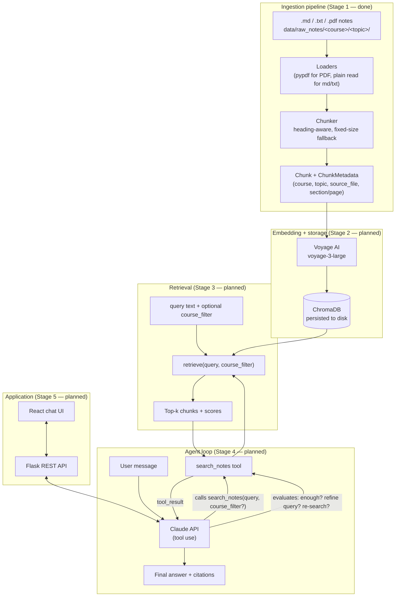

# Architecture

This document tracks the system design and the reasoning behind it. It's
written to be read once and used to defend design choices in a technical
interview — every non-obvious decision below states *why*, not just *what*.
It grows alongside the build; sections marked **(planned)** describe the
target architecture for stages not yet implemented.

## System overview (target)



## Design decisions

### Chunking strategy (Stage 1)

**Heading-aware first, fixed-size as a fallback — not the other way around.**
Course notes are usually already organized by the author into a heading
hierarchy (`# Topic` / `## Subtopic` / `### Detail`). That structure is a free,
high-quality chunk boundary: a heading section is (almost always) one
coherent concept, which is exactly what a retrieval chunk should be. Splitting
purely by fixed size instead would ignore that signal and could cut a
definition in half for no reason. So the chunker tries heading boundaries
first, and only falls back to a fixed-size sliding window when there's no
heading structure to use (plain `.txt`, or a heading section that's too big
to be one chunk on its own).

**Fixed-size chunks use word count, not token count.** A fixed-size chunk
still needs *some* size unit. The options were: LLM token count (via the
Claude API's `count_tokens` endpoint, or a local tokenizer approximation),
or a simple word count. I chose word count because:
- It's free and deterministic — no network call, no dependency on a
  tokenizer library that may or may not match Claude's actual tokenizer
  (approximating Claude's tokenizer with something like `tiktoken`, which is
  OpenAI's tokenizer, would be actively misleading).
- Chunk size doesn't need to be *exact* — it needs to be "roughly one
  concept, roughly consistent size for embedding," and word count is a fine
  proxy for that. ~300 words is roughly 400-450 tokens of English prose,
  which fits comfortably inside Voyage's embedding context with room to
  spare.
- It keeps the chunker pure-stdlib and trivially unit-testable (see
  `tests/test_chunking.py`) without mocking a tokenizer or an API.

**Overlap on the fixed-size fallback, not on heading-based chunks.**
Fixed-size chunking is the case where a boundary is genuinely arbitrary — the
sliding window can cut a sentence or a fact in half. A 50-word overlap
(against a 300-word window) means that content is very likely to appear whole
in at least one of the two adjacent chunks. Heading-based chunks don't get
overlap: their boundary is already semantically meaningful (a new heading
*is* a new topic), so padding across it would just dilute the embedding of
each chunk with unrelated neighboring content.

**A heading section that's too large still gets sub-chunked, but keeps its
section label.** If a `##` section under "Binary Search Trees" runs to 1200
words, it's still chunked with the fixed-size splitter — but every resulting
sub-chunk keeps `section = "Binary Search Trees"` in its metadata (tagged
with `chunking_method = "heading+fixed_size"` to make the hybrid explicit).
The alternative — dropping the section label once a chunk no longer maps
1:1 to a whole section — would make citations less precise for exactly the
sections most likely to matter (the longest, most detailed ones).

**PDFs are chunked per page, attempting heading detection on each page's
extracted text before falling back.** Two reasons to chunk per-page rather
than concatenating the whole PDF into one text blob first: (1) the
non-functional requirement is to cite "source filename and section/page" —
per-page chunking makes the page number free to attach, whereas
concatenating first would require separately tracking page boundaries
through the chunker; (2) `pypdf`'s `extract_text()` on a text-heavy page
already returns something reasonably close to plain text, so running the
same heading-aware chunker over each page's text is a way to opportunistically
recover real structure if the PDF happens to be an export of already-
structured notes (e.g. Markdown or slides with real heading text), while
falling back to fixed-size for image-of-text-style PDFs or ones without
markdown-style headings. This means the chunker is genuinely shared code
between text/markdown and PDF, not two parallel implementations.

**Heading detection uses a simple stack, not a full parse tree.**
`split_markdown_into_sections` tracks a stack of currently-open heading
titles by level, rather than building a nested tree of section objects with
children. Course notes almost never skip heading levels in a way that would
make a stack ambiguous (`h1` → `h3` with no `h2` in between is rare and, if
it happens, the stack just produces a shorter path — it doesn't error or
mis-attribute content). A stack is simpler to implement, reason about, and
test than a tree, for a document domain that doesn't need the tree's extra
generality.

**Fenced code blocks are heading-blind.** A `#` inside a ` ```python ` block
(a Python comment) is not treated as a Markdown heading — the chunker tracks
fence state (` ``` ` / `~~~`) and suppresses heading detection while inside
one. Without this, a code comment in a DSA note would silently fragment the
section it belongs to.

**Course/topic come from the directory structure, not front-matter or a
separate config file.** `data/raw_notes/<course>/<topic>/<file>` is the only
source of truth for those two metadata fields. This means there's nothing to
keep in sync — moving a file to a different topic folder *is* re-tagging it.
The trade-off is that a file can't easily belong to two topics at once, which
is an acceptable constraint for course notes (they're already organized this
way in practice).

### What's deliberately *not* done in Stage 1

- No embedding, no vector storage, no retrieval — those are Stage 2 and 3.
  Stage 1's job is only "raw files in, well-chunked-and-tagged `Chunk`
  objects out," verified independently via `chunks.jsonl` and the test
  suite, before any embedding cost or vector-DB complexity enters the
  picture.
- No deduplication or cross-file linking. Each file is chunked independently;
  if the same concept appears in two files, it produces separate chunks in
  separate files. This is intentional — the citation for each chunk should
  point at exactly the file the student wrote it in.

## Build plan

1. ✅ Repo scaffold + ingestion/chunking pipeline
2. Embedding (Voyage AI `voyage-3-large`) + ChromaDB storage
3. Retrieval logic (standalone, testable without the agent loop)
4. Agent loop with Claude tool use (`search_notes`)
5. Flask API + React chat frontend
6. pytest suite (chunking, retrieval, API)
7. Docker + docker-compose
8. GitHub Actions CI
9. Deployment + this doc's remaining sections
10. (Stretch) Evaluation script + pgvector upgrade
